# Serenus — Manual do Usuário

> **Versão 2.0** · Português BR  
> *Sistema de finanças pessoais e para pequenos negócios*

---

## Sumário

1. [Visão Geral](#1-visão-geral)
2. [Primeiros Passos](#2-primeiros-passos)
3. [Minhas Receitas](#3-minhas-receitas)
4. [Contas a Pagar](#4-contas-a-pagar)
5. [Vendas](#5-vendas)
6. [Cartões de Crédito](#6-cartões-de-crédito)
7. [Gerenciamento de Dívidas](#7-gerenciamento-de-dívidas)
8. [Plano de Contas](#8-plano-de-contas)
9. [Visão Financeira](#9-visão-financeira)
10. [Fluxo de Caixa](#10-fluxo-de-caixa)
11. [Investimentos](#11-investimentos)
12. [Metas Financeiras](#12-metas-financeiras)
13. [Backup e Restauração](#13-backup-e-restauração)
14. [Configurações](#14-configurações)
15. [Exportação para Excel](#15-exportação-para-excel)
16. [Alertas Automáticos](#16-alertas-automáticos)
17. [Modo Demonstração](#17-modo-demonstração)
18. [Ordens de Serviço (interna)](#18-ordens-de-serviço-interna)

---

## 1. Visão Geral

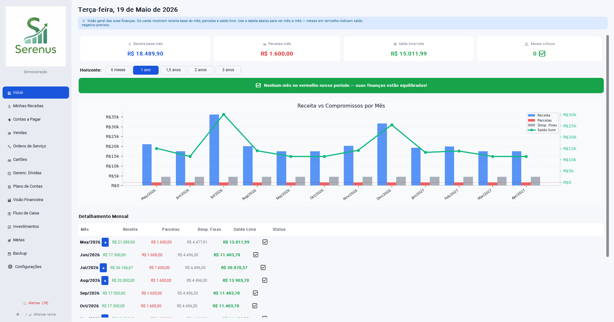

O **Serenus** é um aplicativo de finanças pessoais instalado localmente no seu computador. Todos os dados ficam salvos em um banco de dados SQLite em `%APPDATA%\Serenus\` — nenhuma informação é enviada para a internet.

A partir da **versão 2.0**, o Serenus também cobre o controle financeiro de **pequenos negócios e freelancers**, com módulo completo de vendas, controle de recebíveis e importação de faturas de cartão por planilha.

### Módulos disponíveis

| Ícone | Módulo | O que faz |
|-------|--------|-----------|
| 🏠 | Início (Dashboard) | Resumo financeiro com gráfico de saldo projetado |
| 💰 | Minhas Receitas | Salário, aluguéis, freelas, 13º, férias, bônus e vendas realizadas |
| 💸 | Contas a Pagar | Despesas mensais, recorrências e parcelamento no cartão |
| 🛒 | Vendas | Produtos, serviços, vendas à vista e a prazo, contas a receber |
| 🔧 | Ordens de Serviço | OS internas (manutenção, TI, facilities) com solicitante, materiais e mão de obra |
| 💳 | Cartões | Faturas, compras parceladas, limite e importação de fatura |
| 📉 | Gerenc. Dívidas | Projeção de empréstimos e financiamentos mês a mês |
| 📋 | Plano de Contas | Categorias personalizadas de despesas |
| 📊 | Visão Financeira | Projeção de saldo para os próximos meses |
| 🔄 | Fluxo de Caixa | Extrato consolidado com gráfico receitas × despesas |
| 📈 | Investimentos | Carteira de renda variável, fixa e fundos com IR estimado |
| 🎯 | Metas | Objetivos financeiros com barra de progresso e prazo |
| 💾 | Backup | Salva e restaura todos os dados localmente |
| ⚙️ | Configurações | Preferências e perfis de demonstração |

---

## 2. Primeiros Passos

### 2.1 Instalando o aplicativo

Execute o instalador `SerenusSetup.exe` e siga o assistente. O aplicativo será instalado em `%ProgramFiles%\Serenus\`. Os dados do usuário ficam em `%APPDATA%\Serenus\` e **não são apagados ao desinstalar ou atualizar**.

### 2.2 Primeiro acesso

Na primeira execução o app pergunta seu nome, aplica o tema padrão e cria o banco de dados automaticamente com as categorias de despesa pré-configuradas.

### 2.3 Alternando o tema

No rodapé da barra lateral, clique em **☀️ / 🌙 Alternar tema** para mudar entre claro e escuro. A preferência é salva automaticamente.

### 2.4 Dados de demonstração

Se quiser explorar o sistema com dados prontos antes de cadastrar os seus:

1. Acesse **Configurações → Dados de demonstração**
2. Escolha um dos 8 perfis:

| Perfil | Renda/mês | Perfil financeiro |
|--------|-----------|-------------------|
| Padrão (Classe Média) | ~R$ 10.300 | 2 cartões, 2 dívidas, equilíbrio |
| Apertado | ~R$ 3.500 | 6 cartões, 3 dívidas, saldo negativo |
| Moderado — entrando em dívidas | ~R$ 7.000 | Despesas crescendo |
| Moderado — saindo das dívidas | ~R$ 7.000 | Fase de recuperação |
| No Verde | ~R$ 6.000 | Sobra ~R$500/mês, 1 dívida pequena |
| Primeiro Passo | ~R$ 8.000 | Começa a investir, 3 ativos, 3 metas |
| Em Ritmo | ~R$ 12.000 | Investidor há 3 anos, 6 ativos, 4 metas |
| Patrimônio Crescendo | ~R$ 18.000 | Carteira consolidada, 11 ativos, 4 metas |

3. Clique em **Carregar perfil** e confirme. **Atenção:** esta ação apaga todos os dados atuais.
4. Para voltar ao estado limpo, clique em **Zerar dados**.

---

## 3. Minhas Receitas

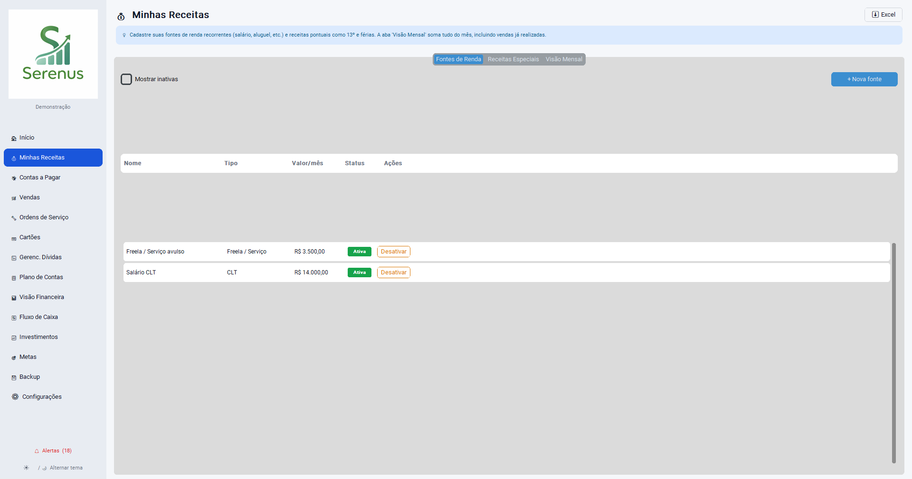

### 3.1 Fontes de receita

Rendas recorrentes que entram todo mês (salário, aluguel, freela, dividendos).

**Como cadastrar uma fonte:**
1. Clique em **+ Nova fonte**
2. Preencha:
   - **Nome** — ex.: "Salário CLT", "Freela Design", "Aluguel Ap. 102"
   - **Tipo** — CLT, Freela, Aluguel, Dividendos ou Outro
   - **Valor mensal bruto**
   - **Periodicidade** — Mensal, Bimestral ou Anual
3. Para **CLT**: o sistema cria automaticamente "13º Salário" (dezembro) e "Férias + 1/3" (mês escolhido) nas receitas especiais
4. Clique em **Salvar**

> **Exemplo:** João tem salário CLT de R$5.000 e freela de R$1.200 bimestral. Cadastra duas fontes. O valor mensal exibido na Visão Financeira considera o freela como R$600/mês (metade do bimestral).

**Ativar/desativar:** clique no ícone 👁. Fontes inativas não entram em nenhum cálculo.

### 3.2 Receitas especiais

Receitas pontuais: 13º salário, férias, bônus, FGTS aniversário, prêmios.

**Como cadastrar:**
1. Aba **Receitas Especiais** → **+ Nova**
2. Preencha: Nome, Mês de recebimento, Valor, Tipo, se repete todo ano
3. Clique em **Salvar**

> **Exemplo:** Maria recebe FGTS aniversário todo mês de março, R$2.400. Cadastra como receita especial recorrente — aparece na Visão Financeira em março de cada ano projetado.

### 3.3 Vendas realizadas no mês *(v2.0)*

A aba **Visão Mensal** agora exibe uma seção **"Vendas e Serviços realizados"** quando há vendas lançadas no módulo Vendas. Os itens listados são:

- Vendas à vista com status **paga** no mês
- Parcelas de venda a prazo **recebidas** no mês

> Isso permite ter uma visão completa da receita: fontes de renda fixas + receitas especiais + vendas efetivadas.

---

## 4. Contas a Pagar

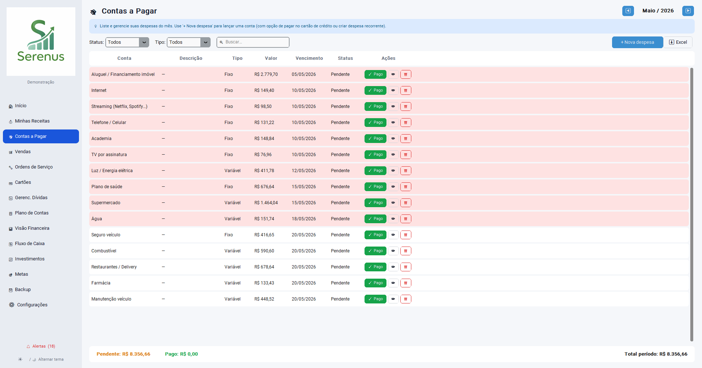

### 4.1 Registrando uma despesa

1. Clique em **+ Nova despesa**
2. Preencha:
   - **Conta** — categoria do Plano de Contas (ex.: Internet, Supermercado)
   - **Valor** e **Data de vencimento** (DD/MM/AAAA)
   - **Status** — Pendente ou Pago
   - **Recorrente** — marque se a despesa se repete todo mês; informe quantos meses lançar de uma vez (1 a 60)
3. Clique em **Salvar**

> **Exemplo:** Internet de R$99,90 todo dia 15. Marcar como recorrente e lançar 12 meses de uma vez cria 12 registros automáticos para o próximo ano.

### 4.2 Pagar com cartão de crédito

Ao registrar uma nova despesa, marque **Pagar com cartão de crédito**:

1. Selecione o cartão
2. Escolha o modo:
   - **Valor total** → informe R$600 e 3 parcelas: o sistema cria parcelas de R$200
   - **Valor da parcela** → informe R$200 e 3 parcelas: o sistema calcula total R$600
3. O preview mostra cada parcela com mês de vencimento
4. Ao salvar: a despesa é registrada em Contas a Pagar **e** as parcelas são lançadas no cartão

### 4.3 Navegando por meses

Use as setas **‹** e **›** para navegar entre meses. Os filtros de status (Todos / Pendentes / Pagos) e de tipo de custo (Todos / Fixo / Variável) estão na barra de filtros.

### 4.4 Marcar como pago

Clique no ícone ✅ na linha da despesa. A data de pagamento é registrada como hoje automaticamente.

### 4.5 Reajuste de recorrentes

Ao editar uma despesa recorrente, o sistema pergunta:
- **Apenas esta** — altera só o mês atual
- **Esta e as próximas** — atualiza todos os lançamentos futuros pendentes com o mesmo valor

> **Exemplo:** O plano de internet subiu de R$99,90 para R$119,90. Edite qualquer mês futuro, informe o novo valor e clique em "Esta e as próximas" para atualizar todos de uma vez.

### 4.6 Busca

Use o campo de busca no topo para localizar despesas por descrição ou nome da categoria. Funciona em todos os meses.

---

## 5. Vendas *(módulo novo — v2.0)*

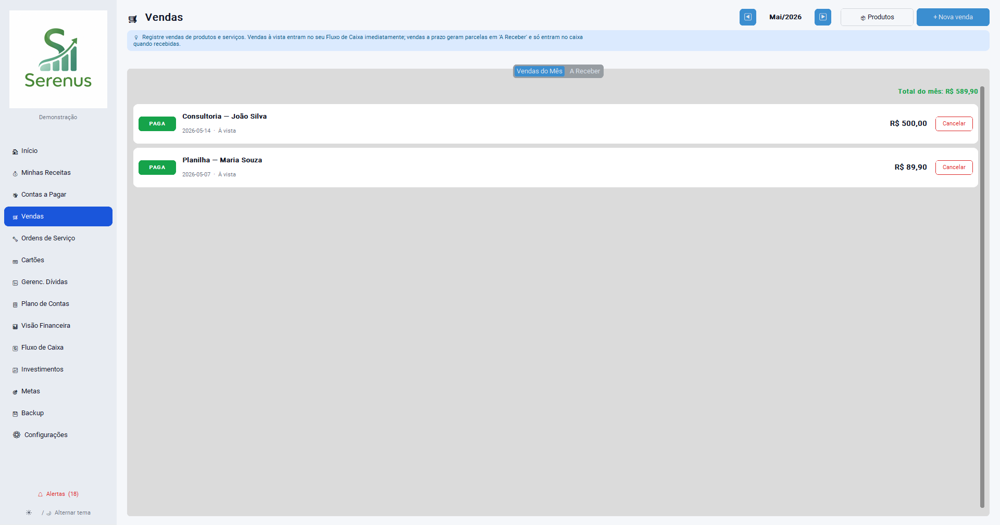

O módulo de Vendas foi projetado para freelancers, prestadores de serviço e microempreendedores que precisam controlar o que venderam, o que receberam e o que ainda está a receber.

### 5.1 Cadastrando produtos e serviços

1. Na aba **Produtos/Serviços**, clique em **+ Novo**
2. Preencha:
   - **Nome** — ex.: "Consultoria Hora", "Site Institucional", "Produto X"
   - **Tipo** — Produto ou Serviço
   - **Preço padrão** — sugerido ao criar uma venda (pode ser alterado)
   - **Descrição** (opcional)
3. Clique em **Salvar**

> **Observação:** alterar o preço de um produto **não afeta** vendas já registradas. O preço histórico fica preservado em cada venda.

### 5.2 Registrando uma venda à vista

1. Clique em **+ Nova venda**
2. Preencha a descrição geral da venda (ex.: "Projeto de logo")
3. Adicione itens: selecione produto/serviço, ajuste quantidade e preço
4. Informe o desconto (se houver) em R$
5. Escolha **À vista**
6. Clique em **Salvar**

O valor líquido entra imediatamente no fluxo de caixa como receita do dia.

> **Exemplo:**
> - Item: "Consultoria Hora" × 4 horas × R$150 = R$600
> - Desconto: R$50
> - Valor líquido: R$550
> - Aparece no extrato do dia como receita de R$550

### 5.3 Registrando uma venda a prazo

1. Clique em **+ Nova venda**
2. Adicione os itens normalmente
3. Escolha **A prazo** e informe:
   - Número de parcelas
   - Data de vencimento de cada parcela
4. Clique em **Salvar**

O dinheiro **não entra no caixa** até cada parcela ser marcada como recebida. A venda fica com status **Pendente**.

> **Exemplo:**
> - Desenvolvimento de site: R$3.000 em 3× de R$1.000
> - Vencimentos: 10/06, 10/07, 10/08
> - No dia 10/06 o cliente paga: marque a parcela como recebida → R$1.000 entra no extrato
> - Após as 3 parcelas recebidas, a venda fecha automaticamente como **Paga**

### 5.4 Acompanhando contas a receber

A aba **A Receber** lista todas as parcelas de vendas a prazo pendentes, ordenadas por vencimento.

Para marcar uma parcela como recebida:
1. Clique no ícone ✅ na linha da parcela
2. Confirme a data de recebimento
3. O valor entra no fluxo de caixa imediatamente

### 5.5 Alertas de recebíveis

O sistema gera alertas automáticos para:
- **Parcela vencida** (urgência alta) — vencimento já passou e ainda não foi recebida
- **Vencendo em 7 dias** (urgência média) — parcela prestes a vencer

Os alertas aparecem no sino 🔔 na barra lateral.

### 5.6 Integração com Visão Financeira

As vendas realizadas aparecem automaticamente:

| Onde | O que aparece |
|------|---------------|
| Fluxo de Caixa / Extrato | Vendas à vista pagas + parcelas recebidas no mês |
| Minhas Receitas (Visão Mensal) | Seção "Vendas e Serviços realizados" com itens individuais |
| Visão Financeira (Projeção) | Sub-item "Vendas e Serviços" nas receitas dos meses reais |

---

## 6. Cartões de Crédito

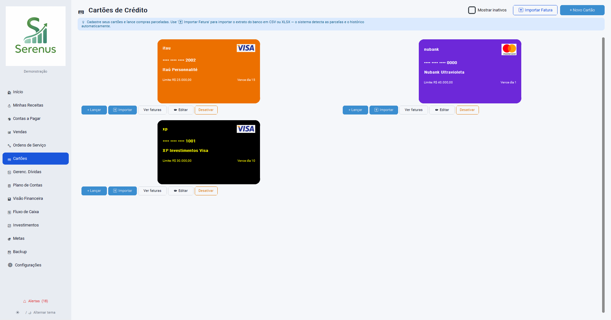

### 6.1 Cadastrando um cartão

1. Clique em **+ Novo cartão**
2. Preencha:
   - Nome, banco e bandeira
   - Últimos 4 dígitos (exibição visual)
   - Limite total e limite disponível
   - Dia de vencimento e dia de fechamento
   - Cor de fundo e cor do texto (personaliza o visual do card)
3. Clique em **Salvar**

### 6.2 Lançando uma compra

1. Em um cartão, clique em **+ Lançar**
2. Preencha: descrição, estabelecimento, valor total, número de parcelas e mês de início
3. O preview mostra cada parcela com valor e mês
4. Ao salvar, o limite é debitado e as parcelas são criadas automaticamente

### 6.3 Importando fatura (CSV ou XLSX) *(v2.0)*

A importação permite lançar várias compras de uma vez a partir do arquivo de extrato exportado pelo banco ou pela operadora do cartão.

#### Passo a passo

1. Clique em **⬆ Importar Fatura** no cabeçalho da tela de Cartões
2. Selecione o cartão de destino no dropdown
3. Escolha o **mês da fatura** (mês de referência das parcelas)
4. Marque ou desmarque **"Criar histórico das parcelas já pagas"**:
   - **Marcado (padrão):** se você importa a parcela 7/12, o sistema cria as parcelas 1 a 6 como *pagas* e as parcelas 7 a 12 como *pendentes* — histórico completo
   - **Desmarcado:** cria apenas as parcelas pendentes (7 a 12), sem histórico
5. Clique em **📂 Abrir arquivo** e selecione o CSV ou XLSX
6. A pré-visualização mostra as linhas detectadas com descrição, parcela e valor
7. Erros de validação aparecem em vermelho — corrija no arquivo antes de importar
8. Clique em **⬆ Importar**

#### Formato do arquivo

O arquivo deve ter as seguintes colunas (em qualquer ordem):

| Coluna | Obrigatório | Exemplo |
|--------|------------|---------|
| `descricao` | Sim | Netflix |
| `valor` | Sim | 55.90 ou 55,90 |
| `parcela` | Não | 3/12 ou "3 de 12" ou vazio (assume 1/1) |
| `estabelecimento` | Não | Netflix Inc |
| `categoria` | Não | Streaming |

> **Formatos aceitos para valor:** `55.90` (ponto decimal) ou `55,90` (vírgula decimal) ou `1.234,56` (milhar com ponto, decimal com vírgula).

> **Formatos aceitos para parcela:** `7/12`, `7 de 12`, `  3 / 12  ` (com espaços). Vazio ou ausente = 1/1.

#### Template XLSX

Se não tiver um arquivo no formato certo, clique em **⬇ Template XLSX** para baixar uma planilha modelo já formatada. Preencha os dados e importe normalmente.

#### Deduplicação e delta incremental

O Serenus detecta automaticamente itens repetidos para evitar lançamentos duplicados:

| Situação | Comportamento |
|----------|---------------|
| Mesmo item importado duas vezes (mesma descrição, mesmo mês, mesma parcela) | Segundo import ignorado |
| Mesmo item, mas mês de referência diferente | Dois lançamentos separados (importações de faturas diferentes) |
| Mesmo item, total de parcelas aumentou (ex.: de 6 para 9) | Adiciona apenas as parcelas faltantes (7, 8, 9) sem duplicar as existentes |

> **Exemplo de importação parcial:**
>
> Fatura de maio mostra: "Netflix 3/12 — R$55,90"
>
> Ao importar com mês=maio e **criar histórico marcado**:
> - Parcelas 1 e 2 (março e abril) → criadas como *pagas*
> - Parcelas 3 a 12 (maio a fevereiro) → criadas como *pendentes*
> - Limite debitado: 10 × R$55,90 = R$559,00 (só o saldo restante)

### 6.4 Visualizando faturas

Clique em **Ver faturas** em um cartão. A tela mostra todas as parcelas do mês selecionado (use ‹ › para navegar). Você pode:

- Marcar parcelas pagas individualmente (ícone ✅)
- Pagar a fatura inteira de uma vez (**Pagar tudo**)
- Exportar a fatura do mês para Excel (**⬇ Excel**)

### 6.5 Lançar fatura em Contas a Pagar

Na tela de faturas, clique em **Lançar fatura em contas a pagar** para criar um único lançamento de despesa no valor total da fatura do mês. Útil para quem quer controlar pelo débito no banco em vez de parcela a parcela.

---

## 7. Gerenciamento de Dívidas

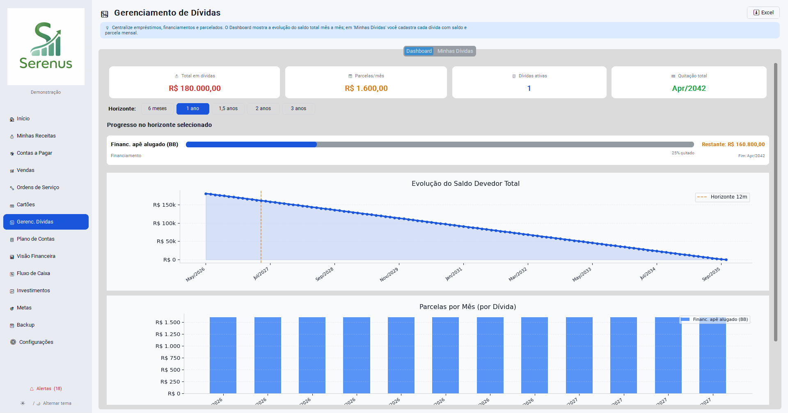

### 7.1 Cadastrando uma dívida

1. Clique em **+ Nova dívida**
2. Preencha:
   - Nome (ex.: "Empréstimo Banco X", "Financiamento Carro")
   - Tipo: empréstimo, financiamento ou cartão
   - Saldo atual
   - Parcela mensal e total de parcelas
   - Parcelas já pagas
   - Dia de vencimento e taxa de juros
3. Clique em **Salvar**

> **Obs.:** cartões de crédito geram uma dívida automática com base nas parcelas pendentes — não é necessário cadastrar manualmente.

### 7.2 Gráfico de evolução

O gráfico mostra a evolução do saldo total de todas as dívidas ativas ao longo do tempo, mês a mês, até a quitação da última dívida.

### 7.3 Exportando

Clique em **⬇ Excel** para exportar a lista de dívidas e a projeção de evolução.

---

## 8. Plano de Contas

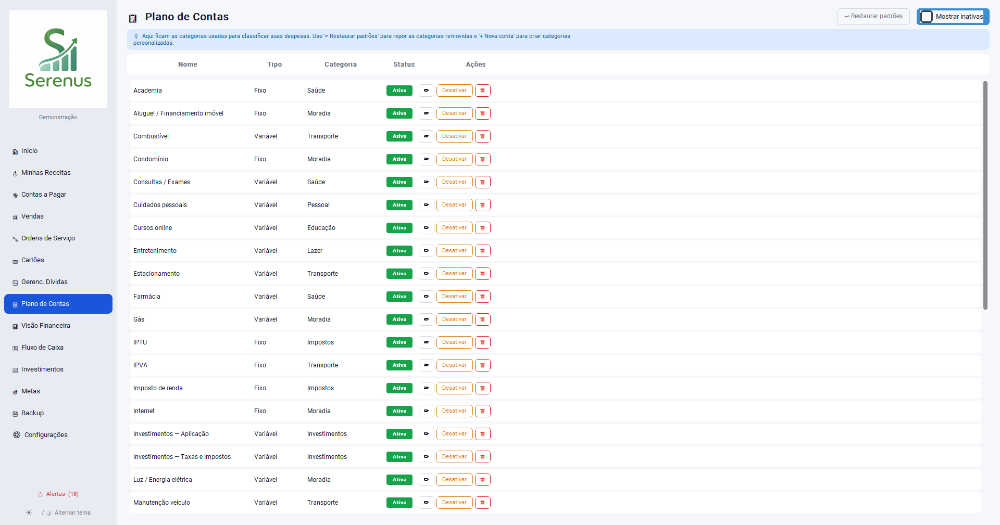

O Plano de Contas organiza despesas em categorias. Cada despesa registrada em **Contas a Pagar** é vinculada a uma conta do plano.

### 8.1 Contas padrão

34 contas pré-configuradas (Aluguel, Internet, Supermercado, etc.). Podem ser **inativadas** mas não excluídas se tiverem lançamentos vinculados.

### 8.2 Criando uma conta personalizada

1. Clique em **+ Nova conta**
2. Preencha: nome, tipo de custo (**Fixo** ou **Variável**), categoria livre
3. Clique em **Salvar**

> **Dica:** use **Fixo** para despesas que repetem todo mês com valor constante (aluguel, streaming) e **Variável** para despesas que oscilam (supermercado, lazer). A separação alimenta os gráficos de Fixo vs Variável na Visão Financeira.

### 8.3 Restaurar padrões

Clique em **↩ Restaurar padrões** para reinserir contas padrão que foram excluídas. As contas existentes não são afetadas.

---

## 9. Visão Financeira

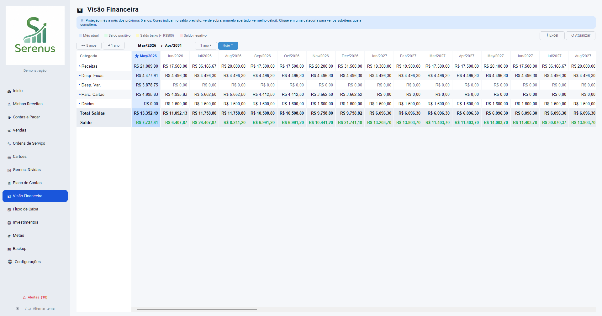

### 9.1 Aba Projeção

Tabela mês a mês com projeção de saldo considerando:
- Receitas das fontes ativas (mensais, bimestrais, anuais)
- Receitas especiais (13º, férias, bônus)
- Vendas realizadas (meses passados/atual — dados reais)
- Despesas registradas em Contas a Pagar
- Parcelas de cartão de crédito
- Dívidas ativas (parcelas futuras)

**Horizonte:** selecione 3, 6, 12, 24 ou 36 meses.

**Legenda de cores:**

| Cor | Significado |
|-----|------------|
| 🔵 Azul | Mês atual |
| 🟢 Verde | Saldo > R$500 |
| 🟡 Amarelo | Saldo entre R$0 e R$499 |
| 🔴 Vermelho | Saldo negativo |

### 9.2 Detalhamento por sub-item

Clique em qualquer célula da tabela para expandir o detalhamento por sub-item. Por exemplo, clicar na coluna "Receitas" de um mês mostra:
- Salário CLT: R$5.000
- Freela Design: R$600
- Vendas e Serviços: R$2.300 *(meses reais)*
- Aluguel Recebido: R$1.500

### 9.3 Aba Receitas vs Despesas

Gráfico de barras comparando receitas e despesas mês a mês no horizonte selecionado.

### 9.4 Exportando

Clique em **⬇ Excel** para baixar a projeção completa em planilha.

---

## 10. Fluxo de Caixa

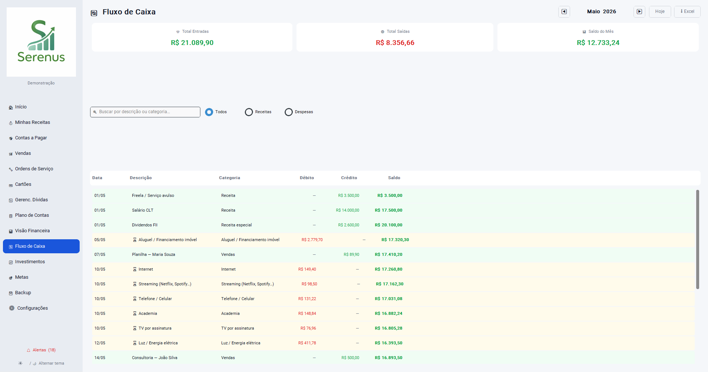

O Fluxo de Caixa é a tela inicial (Dashboard) e mostra a situação financeira consolidada.

### 10.1 Painel de resumo

- **Saldo médio** — média dos saldos mensais no horizonte
- **Receita média** — receita mensal média
- **Despesa média** — despesa mensal média
- **Meses no azul / vermelho** — quantos meses com saldo positivo/negativo

### 10.2 Extrato mensal

Selecione um mês para ver o extrato detalhado com todas as movimentações: receitas de fontes, rendimentos de investimento, vendas e serviços, e despesas de cada categoria.

Recursos do extrato:
- **Busca** — campo de texto para filtrar por descrição
- **Filtro por tipo** — Todos / Receitas / Despesas
- **⬇ Excel** — exporta o extrato do mês

### 10.3 Gráfico

Barras agrupadas com receitas × despesas e linha de saldo ao longo do horizonte selecionado (3, 6, 12, 24 ou 36 meses).

---

## 11. Investimentos

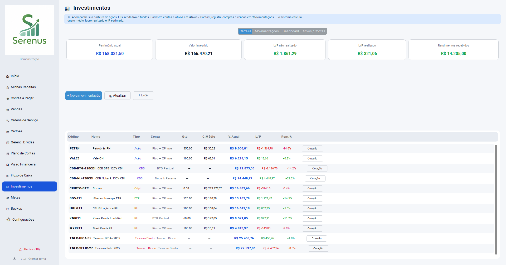

### 11.1 Cadastrando uma conta de investimento

1. Aba **Ativos / Contas** → **+ Conta**
2. Informe nome (ex.: "XP Investimentos"), instituição e tipo (corretora, banco, tesouro)
3. Clique em **Salvar**

### 11.2 Cadastrando um ativo

1. Aba **Ativos / Contas** → **+ Ativo**
2. Informe:
   - Código (ex.: PETR4, IPCA+6%)
   - Nome, tipo (ação, FII, CDB, Tesouro, ETF, cripto)
   - Conta vinculada
3. Para **renda fixa**: informe indexador (IPCA, CDI, Prefixado), taxa e vencimento
4. Clique em **Salvar**

### 11.3 Registrando movimentações

1. Aba **Movimentações** → **+ Movimentação**
2. Selecione ativo, tipo e data:

| Tipo | Campos adicionais |
|------|-------------------|
| Compra / Venda | Quantidade + preço unitário |
| Aplicação / Resgate | Valor total |
| Dividendo / JCP / Juros | Valor recebido |
| Taxa / Imposto | Valor debitado |

3. Marque **Registrar no financeiro** para que o valor entre no Fluxo de Caixa (recomendado para compras e resgates)

### 11.4 Aba Carteira

Posições ativas com custo médio, valor investido, valor atual, lucro/prejuízo e rentabilidade %. Clique no ícone ✏ para atualizar o valor de mercado manualmente ou use **🌐 Buscar API** para cotação automática.

### 11.5 Aba Dashboard

- Alocação por classe (gráfico de barra)
- Rendimentos mensais do ano atual
- Vencimentos próximos (renda fixa nos próximos 12 meses)
- IR estimado por ativo com alíquota regressiva

### 11.6 Exportando

- **Carteira:** botão **⬇ Excel** na aba Carteira
- **IR Estimado:** botão **⬇ Excel** no card de IR no Dashboard

---

## 12. Metas Financeiras

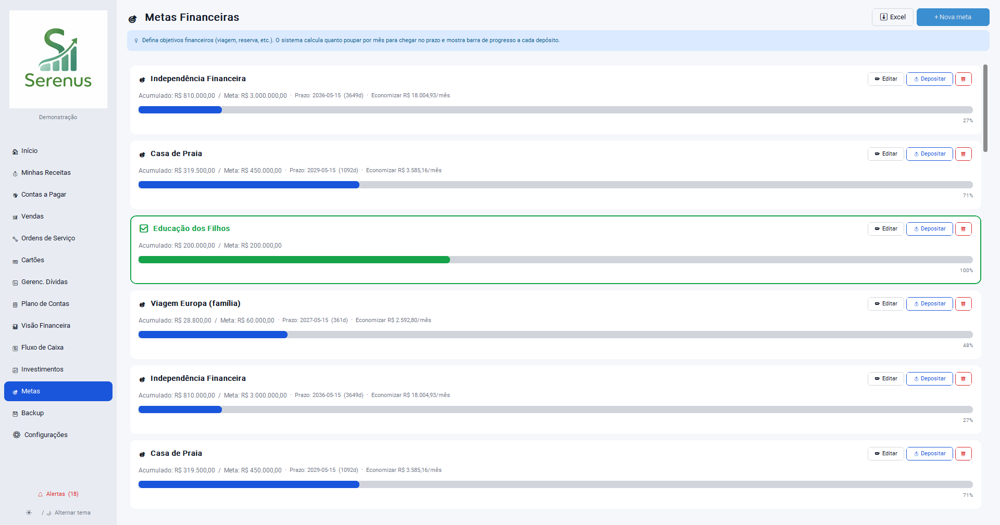

### 12.1 Criando uma meta

1. Clique em **+ Nova meta**
2. Preencha:
   - **Nome** — ex.: "Reserva de emergência", "Viagem Europa"
   - **Valor alvo** — ex.: R$30.000
   - **Valor já guardado** — ex.: R$5.000
   - **Prazo** (opcional) — ex.: 31/12/2026
   - **Descrição** (opcional)
3. Clique em **Salvar**

### 12.2 Acompanhando o progresso

Cada meta exibe:
- Barra de progresso colorida com % concluído
- Dias restantes até o prazo
- **Economia mensal necessária** para atingir a meta no prazo

> **Exemplo:** Meta de R$30.000 com R$5.000 já guardados e prazo em 20 meses → é necessário guardar R$1.250/mês.

### 12.3 Depositando na meta

Clique no ícone ✏ e atualize o campo **Valor já guardado** conforme for acumulando.

### 12.4 Exportando

Clique em **⬇ Excel** para baixar todas as metas com progresso, prazo e economia necessária.

---

## 13. Backup e Restauração

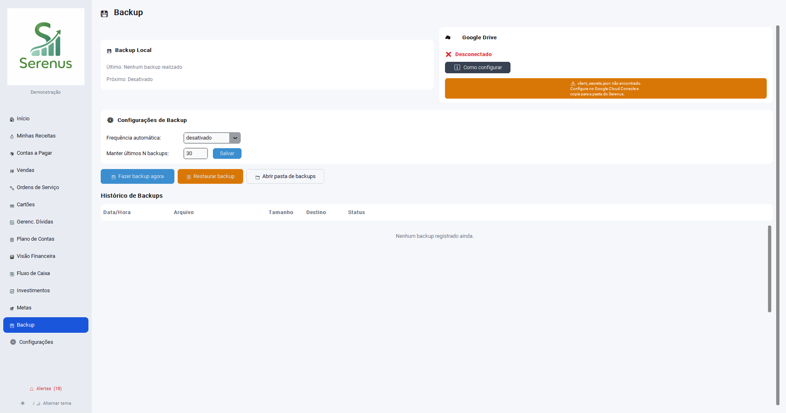

### 13.1 Fazendo backup

1. Acesse **Backup**
2. Clique em **Fazer backup agora**
3. O arquivo `serenus_backup_YYYYMMDD_HHMMSS.db` é salvo automaticamente em `%APPDATA%\Serenus\backups\`

### 13.2 Restaurando um backup

1. Acesse **Backup**
2. Selecione um arquivo na lista
3. Clique em **Restaurar selecionado** e confirme

> **Atenção:** a restauração substitui todos os dados atuais. Faça um backup antes de restaurar.

### 13.3 Backup no Google Drive *(opcional)*

1. Acesse **Backup → Configurar Google Drive**
2. Siga o assistente de autenticação OAuth
3. Após configurado, clique em **Enviar para o Drive** para fazer backup na nuvem

Os dados no Drive são privados — só você tem acesso.

---

## 14. Configurações

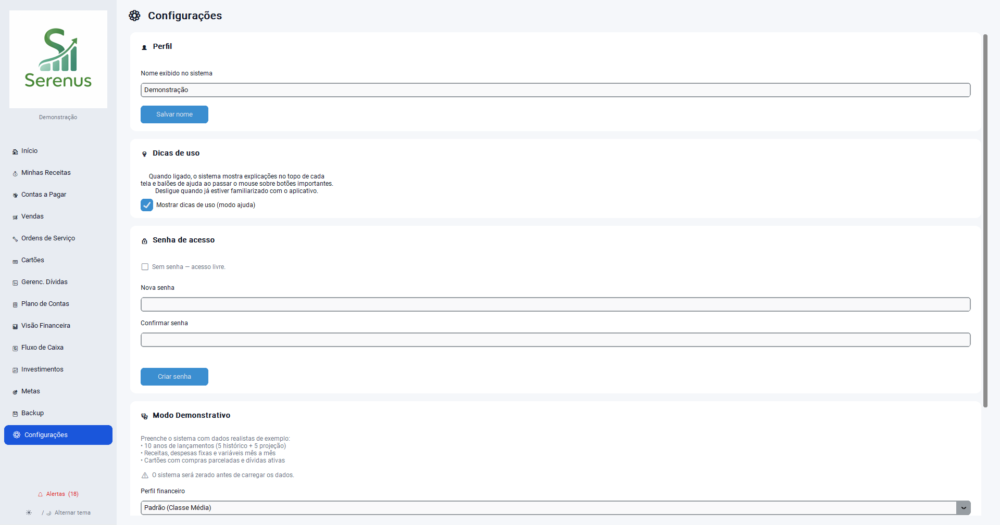

| Opção | Descrição |
|-------|-----------|
| Nome do usuário | Exibido no cabeçalho da barra lateral |
| Tema | Claro ou Escuro (persiste entre sessões) |
| Dados de demonstração | Carrega um perfil de exemplo completo |
| Zerar dados | Apaga todos os dados e recomeça do zero |

---

## 15. Exportação para Excel

Cada módulo com relatórios possui um botão **⬇ Excel** no cabeçalho ou rodapé. Ao clicar, uma janela permite escolher onde salvar o arquivo `.xlsx`.

### Planilhas disponíveis

| Módulo | Arquivo gerado | Conteúdo |
|--------|---------------|---------|
| Contas a Pagar | `contas_pagar_MM-YYYY.xlsx` | Despesas do mês + resumo por categoria |
| Receitas | `receitas.xlsx` | Fontes de receita + receitas especiais |
| Vendas | `vendas_MM-YYYY.xlsx` | Vendas do mês + contas a receber |
| Dívidas | `dividas.xlsx` | Dívidas ativas + projeção de evolução |
| Visão Financeira | `projecao_financeira.xlsx` | Projeção N meses |
| Fluxo de Caixa / Extrato | `extrato_MM-YYYY.xlsx` | Extrato consolidado do mês |
| Fatura Cartão | `fatura_CARTAO_MM-YYYY.xlsx` | Parcelas do mês |
| Carteira | `carteira.xlsx` | Posições ativas com lucro/prejuízo |
| IR Estimado | `ir_estimado.xlsx` | Lucros realizados e IR por ativo |
| Metas | `metas.xlsx` | Metas com progresso e prazo |

### Template de importação de fatura *(v2.0)*

Em **Cartões → ⬆ Importar Fatura**, clique em **⬇ Template XLSX** para baixar a planilha-modelo para importação de fatura. Preencha e importe pelo mesmo modal.

---

## 16. Alertas Automáticos

O sino 🔔 no rodapé da barra lateral exibe o total de alertas pendentes em vermelho. Clique para abrir o painel de alertas com cards coloridos por urgência.

### Tipos de alertas

| Tipo | Condição | Urgência |
|------|----------|---------|
| Conta vencida | Vencimento < hoje, status pendente | 🔴 Alta |
| Conta vencendo | Vence nos próximos 7 dias | 🟡 Média |
| Fatura do mês | Parcelas de cartão no mês atual | 🟡 Média |
| Renda fixa vencida | Ativo com vencimento passado | 🔴 Alta |
| Renda fixa vencendo | Ativo com vencimento nos próximos 30 dias | 🔴 Alta |
| Recebível vencido | Parcela de venda a prazo não recebida após o vencimento | 🔴 Alta |
| Recebível vencendo | Parcela de venda a prazo vence nos próximos 7 dias | 🟡 Média |

Os alertas são gerados automaticamente ao abrir o app e atualizados a cada 30 segundos.

---

## 17. Modo Demonstração

Para explorar o sistema com dados completos sem precisar cadastrar nada:

1. Vá em **Configurações → Dados de demonstração**
2. Selecione o perfil desejado (veja tabela na seção 2.4)
3. Clique em **Carregar perfil**

Os dados populados incluem: contas a pagar, fontes de receita, cartões com compras parceladas, dívidas, produtos, vendas, investimentos e metas — com histórico de meses anteriores e projeção futura já preenchidos.

Para experimentar a **importação de fatura**, use o modo demonstração (perfil "Padrão" tem 2 cartões), depois baixe o template XLSX, preencha com itens de teste e importe.

---

## 18. Ordens de Serviço (interna) *(módulo novo — v2.1)*

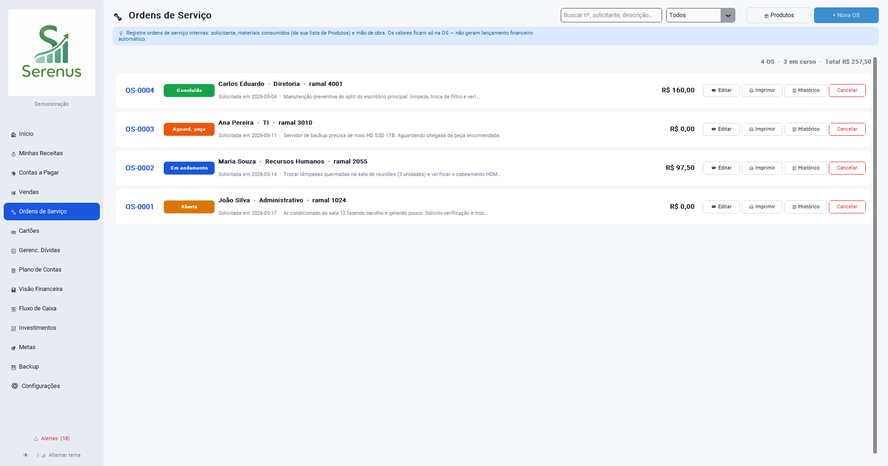

O módulo de **Ordem de Serviço (OS)** controla solicitações internas de manutenção, TI, facilities e qualquer outro tipo de chamado entre setores da empresa. Diferente do módulo de Vendas, **OS não gera lançamento financeiro automático** — os valores (materiais consumidos + mão de obra) ficam registrados apenas na própria OS, para compreensão e rastreabilidade do serviço.

### 18.1 Abrindo uma nova OS

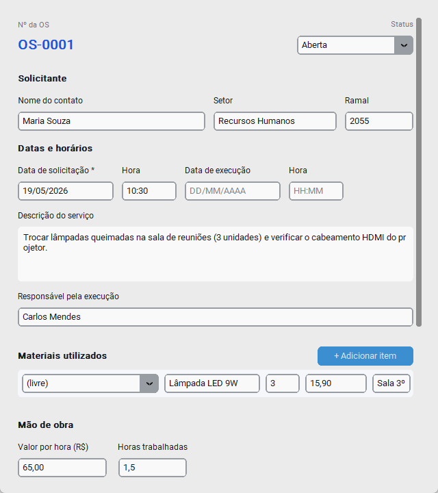

1. Sidebar → **🔧 Ordens de Serviço** → **+ Nova OS**
2. O número da OS é gerado automaticamente no formato **OS-NNNN** (sequencial, nunca reusa números)
3. Preencha as seções:

   **Solicitante:**
   - **Nome do contato** (obrigatório)
   - **Setor** (ex.: TI, RH, Administrativo)
   - **Ramal** (telefone interno)

   **Datas e horários:**
   - **Data de solicitação** (padrão: hoje) e **hora** (HH:MM)
   - **Data de execução** e **hora** (opcionais — preenchidos quando o serviço for executado)

   **Conteúdo:**
   - **Descrição do serviço** — bloco de texto multilinha com o que precisa ser feito
   - **Responsável pela execução** — quem vai/foi executar
   - **Observações gerais** — texto multilinha para informações adicionais

4. Clique em **Registrar OS**

### 18.2 Materiais utilizados

A lista de materiais reusa o cadastro de **produtos do módulo Vendas** — qualquer item cadastrado lá (com `tipo` *produto* ou *serviço*) aparece no dropdown.

1. Na seção **Materiais utilizados**, clique em **+ Adicionar item**
2. Para cada material:
   - Escolha do dropdown (preenche descrição e preço) **ou** deixe `(livre)` e digite manualmente
   - **Quantidade** (aceita decimal: 1,5)
   - **Preço unitário** (preenche se escolheu produto)
   - **Observação** específica do item (opcional — ex.: "Sala 3º andar")
3. Repita para cada material
4. Clique em **✕** ao lado de uma linha para removê-la

> **Sem cadastro prévio:** você pode descrever o material livremente sem precisar cadastrá-lo antes. O cadastro só facilita reuso e o cálculo automático de preço.

### 18.3 Mão de obra

Na seção **Mão de obra**, informe:
- **Valor por hora (R$)** — quanto custa a hora do executor
- **Horas trabalhadas** — aceita decimal (ex.: `2,5` para 2h30)

O sistema calcula automaticamente:
- **Mão de obra** = valor por hora × horas trabalhadas
- **Total da OS** = materiais + mão de obra

O bloco de resumo no rodapé do formulário atualiza em tempo real conforme você digita.

### 18.4 Status da OS

Cada OS tem um status, mostrado como badge colorida na listagem:

| Status | Cor | Quando usar |
|--------|-----|-------------|
| **Aberta** | Amarelo | Recém criada, aguardando atendimento |
| **Em andamento** | Azul | Responsável atribuído, execução em curso |
| **Aguard. peça** | Laranja | Pausada esperando material/peça chegar |
| **Concluída** | Verde | Serviço finalizado |
| **Cancelada** | Cinza | OS desistida (registrada no histórico) |

Para alterar o status: edite a OS (botão **✏ Editar**) e selecione o novo status no dropdown.

### 18.5 Listagem, filtros e busca

A tela principal mostra os cards das OS com: número, badge de status, solicitante (nome · setor · ramal), data de solicitação, descrição truncada e valor total computado.

- **Busca textual** — campo no topo busca em número, solicitante, descrição e observações (case-insensitive)
- **Filtro de status** — dropdown ao lado da busca: Todos / Aberta / Em andamento / Aguard. peça / Concluída / Cancelada
- **Cabeçalho resumido** — total de OS visíveis · quantas em curso · soma dos totais

### 18.6 Editando e cancelando

- **✏ Editar** — abre o modal de cadastro preenchido com a OS atual. Você pode alterar qualquer campo, adicionar/remover materiais e ajustar mão de obra. Cada mudança é registrada no histórico.
- **Cancelar** — botão vermelho. Pede confirmação (não pode ser desfeito). A OS muda para status *Cancelada* e a transição vai para o histórico.

### 18.7 Histórico de alterações

Clique em **📋 Histórico** em qualquer card para abrir a timeline de alterações:

- Cada alteração mostra: data/hora · campo alterado · valor anterior → valor novo
- A criação da OS aparece como primeira entrada (campo `criacao` → número gerado)
- Cancelamentos aparecem como mudança de status

Útil para auditoria: "quem alterou o quê e quando".

### 18.8 Impressão em PDF

Clique em **🖨 Imprimir** em qualquer card para gerar um PDF da OS no layout padrão de mercado, modernizado:

- Header roxo "ORDEM DE SERVIÇO INTERNA"
- Bloco com número, status, datas/horários
- Seções **Solicitante**, **Descrição do Serviço**, **Materiais utilizados**, **Observações gerais**
- Linha de **TOTAL** em destaque no rodapé (materiais + mão de obra)

O PDF é salvo no caminho que você escolher no diálogo (nome padrão: `OS-NNNN.pdf`).

### 18.9 Cadastro auxiliar de produtos

Use o botão **📦 Produtos** no topo da tela para abrir o mesmo modal de produtos do módulo Vendas — sem precisar navegar até lá. Útil para cadastrar peças novas antes de criar a OS.

### 18.10 Isolamento financeiro

OS interna **não cria contas a pagar, não gera receitas e não aparece no extrato/Visão Financeira**. Esta é uma decisão arquitetural: materiais consumidos já foram pagos no momento da compra (registrada separadamente em Contas a Pagar), e mão de obra interna não é despesa nova.

Se você precisa lançar o custo de uma OS no financeiro, faça-o manualmente em **💸 Contas a Pagar** referenciando o número da OS na descrição.

> **Diferença vs Vendas:** Vendas é para serviços/produtos vendidos a clientes externos (gera receita). OS é para serviços internos entre setores (não gera receita).

---

## Apêndice — Atalhos e Dicas Rápidas

| Ação | Como fazer |
|------|-----------|
| Navegar entre meses | Setas **‹** e **›** em Contas a Pagar, Cartões e Extrato |
| Buscar despesa | Campo de busca no topo de Contas a Pagar e Extrato |
| Exportar qualquer tela | Botão **⬇ Excel** no cabeçalho ou rodapé |
| Trocar tema | Rodapé da barra lateral: ☀️ / 🌙 |
| Ver alertas | Sino 🔔 no rodapé da barra lateral |
| Importar fatura de cartão | **Cartões → ⬆ Importar Fatura** (topo da tela) |
| Baixar template de fatura | No modal de importação → **⬇ Template XLSX** |
| Atualizar cotação de ativo | Aba Carteira → ícone ✏ no ativo → **🌐 Buscar API** |
| Pagar fatura inteira | Tela de Faturas → **Pagar tudo** |

---

*Serenus v2.0 — Suas finanças, com clareza.*
