# Serenus — Playbook Prático

> Guia hands-on com **fluxo visual completo** de cada operação.
> Cada capítulo mostra: a tela do módulo → o formulário de cadastro → o resultado.
> Versão 2.3.0 · Português BR
>
> **Novos capítulos v2.3.0**: 18 (importar fatura PDF), 19 (importar
> extrato bancário CSV/OFX/PDF), 20 (lançar manual + conciliar com
> conta_pagar). Veja também `MANUAL_DEMOS.md` para o guia dos 20 perfis demo.

---

## Como ler este playbook

Cada capítulo segue a estrutura:

- 🎯 **Objetivo** — o que você vai conseguir ao final
- 🖼️ **Tela do módulo** — onde clicar
- 📝 **Formulário** — campos a preencher com exemplo
- ✅ **Resultado** — o que muda após salvar
- 💡 **Dicas** / ⚠️ **Cuidados**

Os prints foram capturados com o app rodando — você vai ver exatamente as mesmas telas no seu Serenus.

---

## Sumário

1. [Primeiro acesso e Modo Demo](#1-primeiro-acesso-e-modo-demo)
2. [Cadastrando uma fonte de receita](#2-cadastrando-uma-fonte-de-receita)
3. [Cadastrando uma receita especial (13º, férias)](#3-cadastrando-uma-receita-especial-13º-férias)
4. [Lançando uma despesa simples](#4-lançando-uma-despesa-simples)
5. [Lançando despesa parcelada no cartão](#5-lançando-despesa-parcelada-no-cartão)
6. [Cadastrando um cartão de crédito](#6-cadastrando-um-cartão-de-crédito)
7. [Lançando uma compra direto no cartão](#7-lançando-uma-compra-direto-no-cartão)
8. [Importando fatura CSV/XLSX](#8-importando-fatura-csvxlsx)
9. [Cadastrando um produto ou serviço](#9-cadastrando-um-produto-ou-serviço)
10. [Registrando uma venda à vista](#10-registrando-uma-venda-à-vista)
11. [Registrando uma venda a prazo](#11-registrando-uma-venda-a-prazo)
12. [Marcando o recebimento de uma parcela](#12-marcando-o-recebimento-de-uma-parcela)
13. [Cadastrando uma dívida](#13-cadastrando-uma-dívida)
14. [Registrando uma movimentação de investimento](#14-registrando-uma-movimentação-de-investimento)
15. [Definindo uma meta financeira](#15-definindo-uma-meta-financeira)
16. [Acompanhando o resultado — telas de consulta](#16-acompanhando-o-resultado--telas-de-consulta)
17. [Abrindo uma Ordem de Serviço interna](#17-abrindo-uma-ordem-de-serviço-interna)

---

## 1. Primeiro acesso e Modo Demo

🎯 **Objetivo:** Conhecer o app sem cadastrar dados reais.

Ao abrir o Serenus pela primeira vez, você verá o **Dashboard** já com algumas estimativas baseadas nos dados do setup inicial:


### Modo Demo

Para explorar os módulos sem cadastrar nada:

1. Sidebar → **⚙️ Configurações**.
2. Role até **Dados de Demonstração**.
3. Escolha um perfil (recomendo **Patrimônio Crescendo** para ver tudo em ação).
4. Clique em **Carregar perfil**.

⚠️ Carregar um perfil **apaga os dados anteriores**. Faça **💾 Backup** antes se já tiver lançado dados reais.

💡 Quando quiser começar do zero, vá em **Configurações → 🗑 Zerar sistema** — apaga só os dados financeiros, mantém perfil e senha.

---

## 2. Cadastrando uma fonte de receita

🎯 **Objetivo:** Registrar seu salário (ou outra renda recorrente) para o Serenus calcular sua receita base mensal.

### 2.1 Tela


Sidebar → **💰 Minhas Receitas** → aba **Fontes de Renda** → **+ Nova fonte**.

### 2.2 Formulário

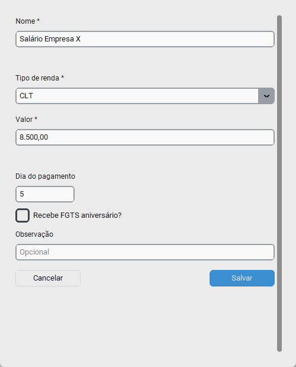

Preencha:
- **Nome:** "Salário Empresa X"
- **Tipo:** CLT (ou Freela, Aluguel, Dividendos, Outro)
- **Valor mensal líquido:** R$ 8.500,00
- **Dia do pagamento:** 5
- **Periodicidade:** Mensal (padrão)

Clique em **Salvar**.

### 2.3 Resultado

A fonte aparece na listagem como **Ativa**. Para o **tipo CLT**, o Serenus cria automaticamente:
- **13º Salário** em dezembro (valor = salário)
- **Férias + 1/3** em junho (valor = salário × 4/3)

Verifique na aba **Receitas Especiais** — você verá essas duas entradas pré-criadas.

💡 **Visão Mensal:** A terceira aba soma tudo do mês (fontes + especiais + vendas realizadas).

---

## 3. Cadastrando uma receita especial (13º, férias)

🎯 **Objetivo:** Registrar entradas pontuais como bônus, restituição de IR ou 14º salário.

### 3.1 Formulário

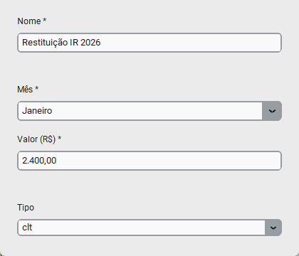

**💰 Minhas Receitas** → aba **Receitas Especiais** → **+ Nova receita**.

Preencha:
- **Nome:** "Restituição IR 2026"
- **Mês:** Junho (selecione no dropdown)
- **Valor:** R$ 2.400,00
- **Tipo:** Outro
- **Recorrente anual:** marque se acontece todo ano

### 3.2 Resultado

A receita entra no mês selecionado em todas as projeções (Visão Financeira, Fluxo de Caixa). Se marcou como recorrente anual, ela se repete em todos os anos futuros.

---

## 4. Lançando uma despesa simples

🎯 **Objetivo:** Registrar uma conta a pagar do mês (luz, água, plano de saúde, etc.).

### 4.1 Tela


Sidebar → **💸 Contas a Pagar** → **+ Nova despesa**.

### 4.2 Formulário

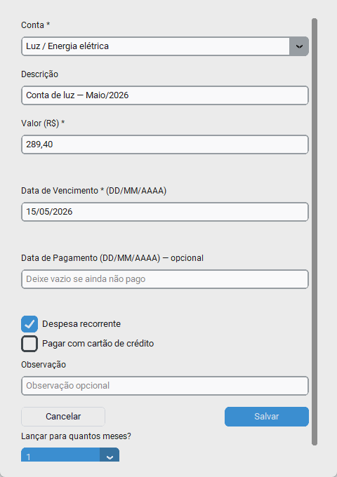

Preencha:
- **Conta:** Luz / Energia elétrica (do plano de contas)
- **Descrição:** "Conta de luz — Maio/2026"
- **Valor:** R$ 289,40 (máscara automática — digite só números)
- **Data de Vencimento:** 15/05/2026 (DD/MM/AAAA)
- **Data de Pagamento:** vazio (preencha quando pagar)

Clique em **Salvar**.

### 4.3 Resultado

A despesa aparece na lista do mês com status **Pendente** (fundo vermelho-claro). Quando pagar:

1. Localize a linha na tabela.
2. Clique em **✓ Pago** na coluna Ações.
3. O sistema grava a data atual como pagamento.

💡 **Despesa recorrente:** Marque o checkbox e informe quantos meses replicar. O Serenus cria N entradas idênticas (uma por mês).

⚠️ **Reajuste em lote:** Editar uma despesa recorrente pergunta: "Apenas esta" ou "Esta e as próximas". Use a segunda quando reajustar aluguel ou plano de saúde.

---

## 5. Lançando despesa parcelada no cartão

🎯 **Objetivo:** Comprar algo parcelado no cartão de crédito — o Serenus cria automaticamente todas as parcelas no Fluxo de Caixa.

### 5.1 Formulário

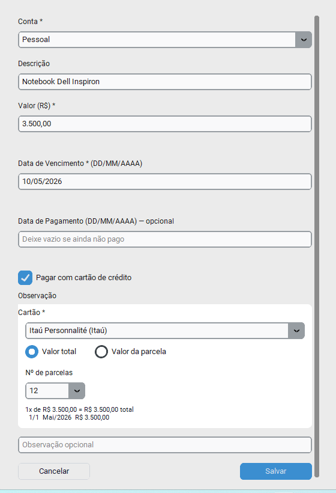

Mesma tela de **+ Nova despesa**, mas marque **✓ Pagar com cartão de crédito**.

Preencha:
- **Conta:** Pessoal
- **Descrição:** "Notebook Dell Inspiron"
- **Valor:** R$ 3.500,00
- **Data de Vencimento:** 10/05/2026
- **Cartão:** Itaú Personnalité (escolha do dropdown)
- **Valor total** ou **Valor da parcela** (radio)
- **Nº de parcelas:** 12

O **preview** mostra: `1x de R$ 3.500,00 = R$ 3.500,00 total · 1/1 Mai/2026 R$ 3.500,00` (atualiza conforme você muda os campos).

### 5.2 Resultado

O Serenus cria de uma vez:
- 1 entrada em `compras_cartao` (controle de fatura)
- 12 parcelas em `parcelas_cartao` (uma por mês)
- 12 entradas em `contas_pagar` (para o Fluxo de Caixa)
- Atualiza o **limite disponível** do cartão
- Atualiza a **dívida** vinculada ao cartão

⚠️ Para cancelar a compra inteira, vá em **💳 Cartões → Ver faturas** e exclua a compra de lá — não delete parcelas individualmente.

---

## 6. Cadastrando um cartão de crédito

🎯 **Objetivo:** Adicionar um novo cartão ao sistema com preview visual ao vivo.

### 6.1 Tela


Sidebar → **💳 Cartões** → **+ Novo Cartão**.

### 6.2 Formulário com preview ao vivo

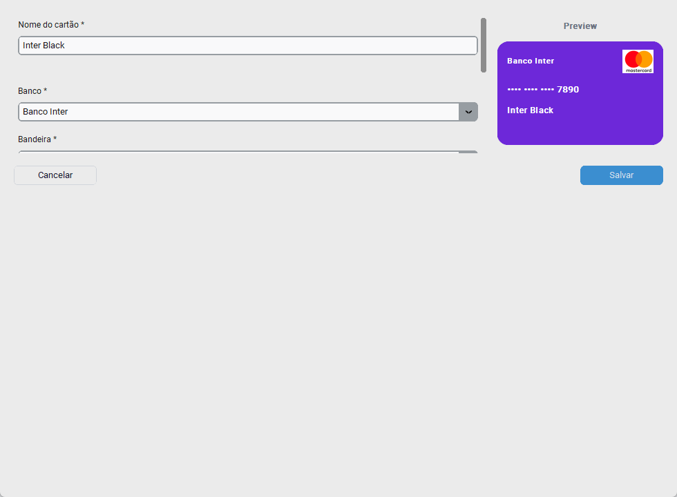

Preencha:
- **Nome:** "Inter Black"
- **Banco:** Banco Inter → a **cor de fundo** do card muda automaticamente
- **Bandeira:** Mastercard → o **logo** aparece no canto
- **Últimos 4 dígitos:** 7890
- **Limite total:** R$ 15.000,00
- **Dia de fechamento:** 13
- **Dia de vencimento:** 20

O **Preview** à direita atualiza em tempo real conforme você digita.

💡 **Bandeira customizada:** Escolha **+ Nova bandeira...** no dropdown para cadastrar bandeiras regionais (Banescard, Cabal, etc.).

### 6.3 Resultado

O cartão aparece na grade principal com a cor do banco e logo da bandeira. Já fica disponível em:
- Modal de Nova despesa (opção "Pagar com cartão")
- Modal de Lançar compra
- Modal de Importar fatura

---

## 7. Lançando uma compra direto no cartão

🎯 **Objetivo:** Registrar uma compra parcelada usando o atalho da tela de Cartões (alternativa ao caminho via Contas a Pagar).

### 7.1 Formulário

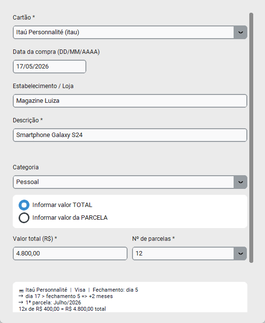

Na grade de cartões, clique em **+ Lançar** no cartão desejado.

Preencha:
- **Descrição:** "Smartphone Galaxy S24"
- **Estabelecimento:** "Magazine Luiza"
- **Categoria:** Pessoal
- **Valor total:** R$ 4.800,00
- **Número de parcelas:** 12
- **Mês de referência inicial:** padrão = mês atual

### 7.2 Resultado

Idêntico ao [Capítulo 5](#5-lançando-despesa-parcelada-no-cartão): cria compra + 12 parcelas + 12 entradas em contas_pagar, debita limite, atualiza dívida.

⚠️ A **última parcela** pode ter centavos diferentes (absorve arredondamento). Ex.: R$ 100/3 = R$ 33,33 + R$ 33,33 + **R$ 33,34**.

---

## 8. Importando fatura CSV/XLSX

🎯 **Objetivo:** Importar a fatura do banco em vez de digitar cada compra — economiza tempo enorme.

### 8.1 Formulário

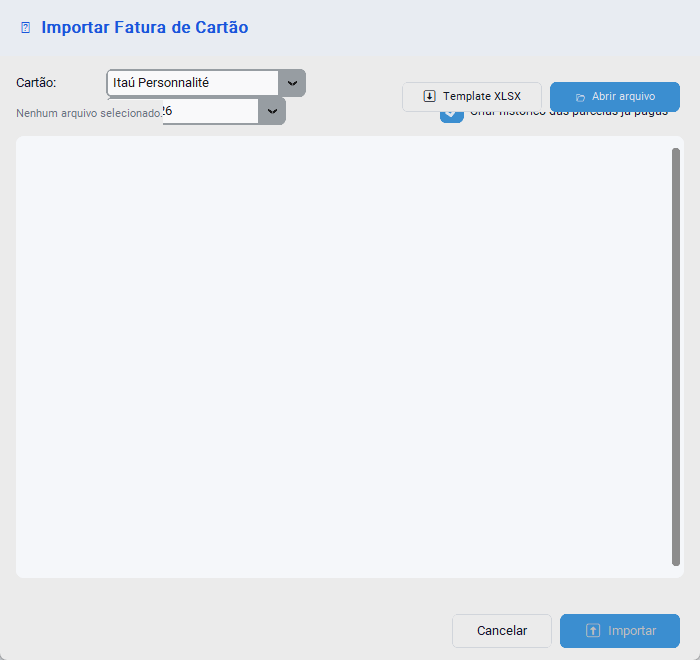

**💳 Cartões** → botão **⬆ Importar Fatura** no topo.

Preencha:
- **Cartão:** escolha no dropdown
- **Mês da fatura:** "Maio 2026" (o mês das parcelas que estão sendo cobradas)
- **✓ Criar histórico das parcelas já pagas** (recomendado)
- Clique em **⬇ Template XLSX** para baixar o modelo, OU **📂 Abrir arquivo** se já tem o CSV/XLSX do banco

### 8.2 Formato do arquivo

O arquivo precisa ter estas colunas (qualquer ordem):

| descricao | estabelecimento | categoria | parcela | valor    |
|-----------|-----------------|-----------|---------|----------|
| Netflix   | Netflix         | Lazer     | 1/1     | 39,90    |
| Smartphone | Magazine X     | Pessoal   | 3/12    | 200,00   |
| Mercado   | Mercado Bom     | Aliment.  | 1/1     | 1.234,56 |

- **descricao** + **valor**: obrigatórios
- **parcela**: formato "N/M" (ex.: "3/12") ou vazio = 1/1
- **valor**: aceita "R$ 100,00", "1.234,56", "199.90"

### 8.3 Pré-visualização e validação

Após selecionar o arquivo, o modal mostra:
- Tabela de pré-visualização (Descrição, Parcela, Valor, Categoria)
- Erros detectados (se houver) em vermelho
- Resumo: "X item(ns) · Total: R$ Y"

Se tudo OK, clique em **⬆ Importar**.

### 8.4 Resultado

- N compras criadas em `compras_cartao`
- Parcelas históricas (1 a N-1) marcadas como **pago**
- Parcela atual e futuras marcadas como **pendente** + entradas em `contas_pagar`
- Limite do cartão debitado
- **Dedup automático**: importar 2× ignora as duplicatas

⚠️ Se o CSV tem typos na descrição entre faturas ("Netflix" vs "NETFLIX *"), o Serenus trata como compras separadas. Padronize antes.

---

## 9. Cadastrando um produto ou serviço

🎯 **Objetivo:** Cadastrar o que você vende para usar nas vendas futuras.

### 9.1 Formulário

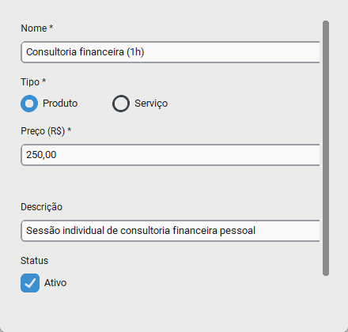

Sidebar → **🛒 Vendas** → botão **📦 Produtos** → **+ Novo produto**.

Preencha:
- **Nome:** "Consultoria financeira (1h)"
- **Tipo:** Serviço (ou Produto)
- **Preço sugerido:** R$ 250,00
- **Descrição:** opcional ("Sessão individual de consultoria")

### 9.2 Resultado

O produto aparece na listagem da aba **📦 Produtos**. Você pode reutilizá-lo em vendas futuras escolhendo do dropdown — o preço preenche automaticamente.

💡 **Sem cadastro prévio:** Você pode vender com descrição livre sem cadastrar produto — mas cadastrar facilita reuso.

---

## 10. Registrando uma venda à vista

🎯 **Objetivo:** Receber dinheiro hoje pela venda de um produto/serviço.

### 10.1 Tela


Sidebar → **🛒 Vendas** → **+ Nova venda**.

### 10.2 Formulário

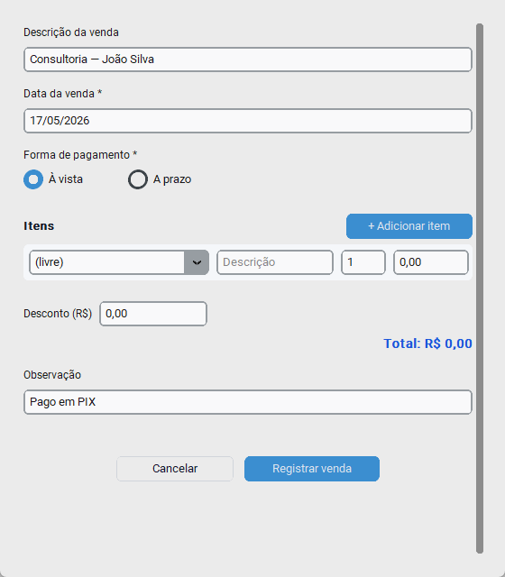

Preencha:
- **Descrição:** "Consultoria — João Silva"
- **Data:** padrão = hoje
- **Forma de pagamento:** ⚫ À vista
- **Itens:**
  - Clique em **+ Adicionar item**
  - Escolha produto no dropdown (ou descrição livre)
  - Quantidade e preço unitário (preenche se escolheu produto)
- **Desconto (R$):** 0,00 (opcional)
- **Observação:** "Pago em PIX"

Clique em **Registrar venda**.

### 10.3 Resultado

- Venda criada com status **paga**
- Itens vinculados
- **Crédito imediato no Fluxo de Caixa** na data da venda
- Já entra no card "Receita base/mês" do Dashboard
- Aparece na **Visão Mensal de Receitas**

---

## 11. Registrando uma venda a prazo

🎯 **Objetivo:** Vender parcelado — o dinheiro só entra quando o cliente pagar cada parcela.

### 11.1 Formulário

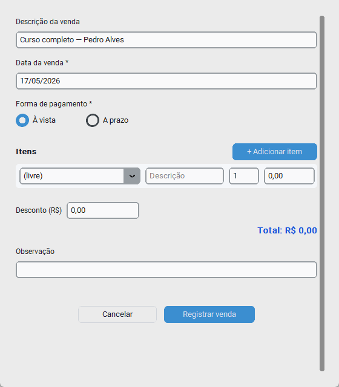

Mesmo modal, mas:

- **Forma de pagamento:** ⚫ A prazo
- **Número de parcelas:** 3
- **Data da primeira parcela:** 27/05/2026 (vence em 10 dias)

### 11.2 Resultado

- Venda criada com status **pendente**
- 3 entradas em `contas_a_receber` (uma por parcela, valor dividido)
- **Não cria crédito** ainda — dinheiro vai entrar conforme você marcar como recebido
- Aparece na aba **A Receber** da tela de Vendas

⚠️ A **última parcela** absorve diferença de arredondamento (igual cartão).

---

## 12. Marcando o recebimento de uma parcela

🎯 **Objetivo:** Confirmar que o cliente pagou uma parcela — o dinheiro entra no Fluxo de Caixa.

### 12.1 Formulário

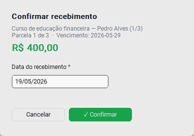

**🛒 Vendas** → aba **A Receber** → **✓ Receber** ao lado da parcela.

Preencha:
- **Data do recebimento:** padrão = hoje (mude se foi outra data)
- Confirme

### 12.2 Resultado

- Parcela marcada como **recebido** + data gravada
- **Crédito criado no Fluxo de Caixa** na data informada
- **Status da venda atualizado**:
  - Última parcela recebida → venda vira **paga**
  - Pelo menos uma recebida → venda fica **parcial**
- Alerta correspondente desaparece (se havia)

⚠️ Marcar recebida uma parcela **já cancelada** é ignorado pelo sistema (no-op). Para reativar uma venda cancelada, refaça o cadastro.

---

## 13. Cadastrando uma dívida

🎯 **Objetivo:** Centralizar empréstimos e financiamentos com projeção de quitação.

### 13.1 Tela


Sidebar → **📉 Gerenc. Dívidas** → aba **Minhas Dívidas** → **+ Nova dívida**.

### 13.2 Formulário

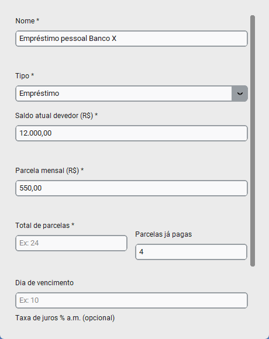

Preencha:
- **Nome:** "Empréstimo pessoal Banco X"
- **Tipo:** Empréstimo (ou Financiamento, Cartão, Outro)
- **Saldo atual:** R$ 12.000,00
- **Parcela mensal:** R$ 550,00
- **Total de parcelas:** 24
- **Parcelas pagas:** 4
- **Dia de vencimento:** 10
- **Taxa de juros (% a.a.):** 3,5 (informativo)

### 13.3 Resultado

A dívida aparece no **Dashboard** com:
- KPIs (saldo total, parcela mensal, quantas dívidas, data de quitação)
- **Gráfico de evolução** do saldo devedor (cai a zero ao longo do tempo)
- **Barras de parcelas por mês**

⚠️ **Cartões cadastrados** geram dívidas automáticas — não cadastre manualmente. Se excluir a dívida do cartão, ela é recriada na próxima atualização.

---

## 14. Registrando uma movimentação de investimento

🎯 **Objetivo:** Registrar compra, venda, dividendo ou rendimento de um ativo.

### 14.1 Tela


Sidebar → **📈 Investimentos** → aba **Movimentações** → **+ Nova movimentação**.

### 14.2 Formulário

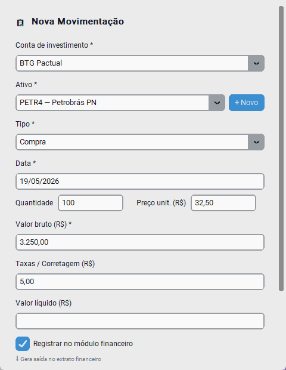

Preencha:
- **Conta:** Corretora cadastrada (ex.: Rico — XP Invest)
- **Ativo:** PETR4 (cadastrado na aba Ativos / Contas)
- **Tipo:** Compra (ou Venda, Dividendo, JCP, Juros, Resgate, Taxa, Imposto)
- **Data:** DD/MM/AAAA
- **Quantidade:** 100
- **Preço unitário:** R$ 32,50
- **Valor bruto:** R$ 3.250,00 (calculado automaticamente)
- **Taxas:** R$ 5,00 (corretagem + emolumentos)
- **Valor líquido:** R$ 3.255,00 (com taxas)
- **✓ Registrar no financeiro** — cria entrada em Contas a Pagar para o caixa

### 14.3 Resultado

- Movimentação registrada
- **Custo médio** do ativo recalculado automaticamente
- Posição na **Carteira** atualizada
- Se for Compra/Aplicação/Taxa/Imposto com "Registrar no financeiro" → cria saída em **Contas a Pagar**
- Se for Dividendo/Juros/JCP → cria crédito no **Fluxo de Caixa**

⚠️ O Serenus **não permite vender mais do que você tem** (bloqueia overselling). Para corrigir histórico, edite a quantidade da compra original.

💡 **Cotação automática:** Botão **🌐 Buscar API** atualiza preços via brapi.dev (sem cadastro).

---

## 15. Definindo uma meta financeira

🎯 **Objetivo:** Acompanhar um objetivo (viagem, casa, reserva) com barra de progresso e cálculo de poupança mensal.

### 15.1 Tela


Sidebar → **🎯 Metas** → **+ Nova meta**.

### 15.2 Formulário

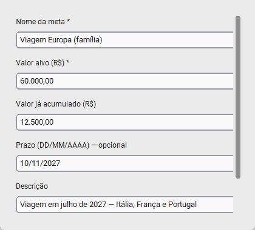

Preencha:
- **Nome:** "Viagem Europa (família)"
- **Valor alvo:** R$ 60.000,00
- **Valor atual (acumulado):** R$ 12.500,00
- **Prazo:** 11/11/2027 (opcional)
- **Descrição:** "Viagem em julho de 2027 — Itália, França e Portugal"

### 15.3 Resultado

A meta aparece com **barra de progresso**. O Serenus calcula automaticamente:
- **% concluído:** 20.8%
- **Economia mensal necessária:** R$ 2.578,51/mês para chegar ao prazo
- **Dias restantes:** N dias

Quando poupar algo:
1. Botão **💰 Depositar** na meta
2. Informe o valor depositado
3. O `valor_atual` cresce e a barra avança

Quando chegar a 100%, a meta fica **verde com ✓ concluída**.

⚠️ Depósitos em metas são **rastreadores manuais** — não saem automaticamente do Fluxo de Caixa. Se quiser que o valor saia do caixa real, lance manualmente em **Contas a Pagar** com plano "Reserva / Poupança".

---

## 16. Acompanhando o resultado — telas de consulta

Após cadastrar suas operações, use estas telas para acompanhar:

### 16.1 Dashboard (tela inicial)


- **Cards superiores:** Receita base/mês · Parcelas/mês · Saldo livre · Meses críticos
- **Gráfico mês a mês:** Receita vs Compromissos vs Saldo livre
- **Tabela detalhada:** linhas verde/amarelo/vermelho conforme saldo

### 16.2 Fluxo de Caixa — Extrato detalhado


Sidebar → **🔄 Fluxo de Caixa**. Mostra **todos os lançamentos do mês** com saldo acumulado:
- Fontes de receita
- Receitas especiais
- Vendas à vista
- Recebíveis quitados
- Rendimentos de investimentos
- Despesas (contas a pagar)

Filtros: busca por texto + radio Todos/Receitas/Despesas.
Exportação: **⬇ Excel** no topo.

### 16.3 Visão Financeira — projeção 5 anos


Sidebar → **📊 Visão Financeira**. Planilha com 60 meses:
- 🟦 Mês atual em azul claro
- 🟢 Saldo > R$ 500 em verde
- 🟡 Saldo R$ 0–500 em amarelo
- 🔴 Saldo negativo em vermelho

Clique em uma categoria do cabeçalho para **expandir os sub-itens** que a compõem.

### 16.4 Plano de Contas — categorias


Sidebar → **📋 Plano de Contas**. Personalize as categorias usadas em Contas a Pagar:
- **+ Nova conta:** cria categoria customizada
- **↩ Restaurar padrões:** recria categorias padrão excluídas
- **🗑:** exclui (bloqueado se tiver lançamentos)

### 16.5 Backup e Configurações


- **💾 Backup:** Criar/restaurar localmente ou Google Drive
- **⚙️ Configurações:** Perfil, modo ajuda, senha, dados demo, zerar sistema

---

## 17. Abrindo uma Ordem de Serviço interna

🎯 **Objetivo:** Registrar um chamado interno (manutenção, TI, facilities) com solicitante, materiais consumidos e mão de obra — sem afetar o financeiro do app.

### 17.1 Tela


Sidebar → **🔧 Ordens de Serviço**.

Você vê os cards de OS com **número** (`OS-0001`), **badge de status** colorida (Aberta / Em andamento / Aguard. peça / Concluída / Cancelada), **solicitante** (nome · setor · ramal), **data de solicitação** e **valor total** computado (materiais + mão de obra).

No topo:
- Campo de **busca** (filtra por número, solicitante, descrição, observações)
- Dropdown de **filtro de status**
- Botão **📦 Produtos** (atalho para cadastrar materiais novos sem sair da tela)
- Botão **+ Nova OS**

### 17.2 Cadastrando uma OS


Clique em **+ Nova OS**. O modal já mostra o próximo número (ex.: `OS-0002`) no canto superior esquerdo.

Preencha:

**Solicitante**
- **Nome do contato:** "Maria Souza"
- **Setor:** "Recursos Humanos"
- **Ramal:** "2055"

**Datas e horários**
- **Data de solicitação:** padrão = hoje · **Hora:** "10:30"
- **Data de execução:** deixe em branco (preenche quando o serviço for executado)

**Descrição do serviço:**
> *"Trocar lâmpadas queimadas na sala de reuniões (3 unidades) e verificar o cabeamento HDMI do projetor."*

**Responsável pela execução:** "Carlos Mendes"

**Materiais utilizados** — clique em **+ Adicionar item**:
- Item 1: Selecione "Lâmpada LED 9W [produto]" do dropdown → preço preenche automático (R$ 15,90) · Quantidade: 3 · Observação: "Sala 3º andar"
- Item 2: Deixe `(livre)` → digite "Cabo HDMI 2m" · Quantidade: 1 · Preço: 22,50

**Mão de obra**
- **Valor por hora (R$):** 65,00
- **Horas trabalhadas:** 1,5 (aceita decimal)

O rodapé do modal mostra os totais atualizando ao vivo:
```
Materiais: R$ 70,20
Mão de obra: R$ 97,50  (1,5h × R$ 65,00)
Total: R$ 167,70
```

Clique em **Registrar OS**.

### 17.3 Resultado

- OS criada com status **Aberta** e número sequencial
- Aparece como primeiro card na listagem (mais recente no topo)
- O histórico já tem 1 entrada: criação da OS
- Os materiais ficam vinculados via FK opcional aos produtos cadastrados (se você escolheu do dropdown)

💡 **Reuso de produtos:** Os produtos do módulo **Vendas** ficam disponíveis aqui — qualquer item com `tipo='produto'` ou `tipo='servico'` aparece no dropdown. Não precisa cadastrar duas vezes.

### 17.4 Mudando o status

Clique em **✏ Editar** no card da OS e altere o status no dropdown:
- Atribuiu um técnico? → **Em andamento**
- Esperando peça chegar? → **Aguard. peça**
- Serviço executado? → **Concluída** (preencha data/hora de execução)
- Solicitação desistiu? → Botão **Cancelar** (vermelho) na própria lista, com diálogo de confirmação

Cada mudança vai para o **📋 Histórico** automaticamente.

### 17.5 Imprimindo a OS em PDF

Clique em **🖨 Imprimir** no card. O sistema abre o diálogo de salvar e gera um PDF com o layout padrão de mercado:

- Header roxo "ORDEM DE SERVIÇO INTERNA"
- Bloco com identificação (Nº, status, datas/horários)
- Seções **Solicitante**, **Descrição do Serviço**, **Materiais utilizados**, **Observações gerais**
- Linha de **TOTAL** em destaque no rodapé

Nome padrão do arquivo: `OS-0002.pdf`.

### 17.6 Histórico de alterações

Clique em **📋 Histórico** em qualquer card para abrir a timeline. Útil em auditorias: quem mudou o quê, quando.

⚠️ **OS interna não vai pro financeiro:** Materiais e mão de obra ficam **só** na OS. Não geram contas a pagar, nem aparecem no extrato/Visão Financeira. Se quiser registrar o custo no financeiro, lance manualmente em **💸 Contas a Pagar** referenciando o número da OS na descrição.

---

## 18. Importando fatura de cartão em PDF *(v2.3.0)*

Use quando você tem o **PDF original da fatura** do banco e não quer
exportar pra planilha. O Serenus reconhece 7 emissores diferentes.

**Pré-requisitos:** já ter o cartão cadastrado no módulo Cartões.

**Tela inicial:**


**Passo a passo:**

1. Sidebar → **💳 Cartões**
2. No cartão desejado, clique em **⬆ Importar**
3. Na escolha de formato, clique em **PDF**
4. Selecione o arquivo PDF da fatura no `filedialog`
5. **Se o PDF for protegido por senha**, o sistema pede inline
6. Sistema detecta automaticamente o emissor e mostra preview com:
   - N itens detectados, total R$
   - Layout reconhecido (nubank, itau, luizacred, digio, will, mercadolivre)
7. Revise os itens, marque/desmarque **"Criar histórico das parcelas já pagas"**
8. (Opcional) Informe **Vencimento (DD/MM/AAAA)** se quiser sobrescrever a
   data padrão das parcelas
9. Clique em **⬆ Importar**

**Resultado:** as compras viram parcelas em `parcelas_cartao`, o limite é
debitado, e o gráfico de utilização do cartão atualiza.

✅ **Dica:** dedup automático — se você importar a mesma fatura 2 vezes,
nada duplica. O Serenus identifica pela chave (cartão, descrição, mês,
parcela).

⚠️ **Magazine Luiza tem limitação conhecida:** o layout do PDF Luizacred
mistura "lançamentos atuais" com "compras parceladas - próximas faturas"
no texto extraído. Você precisa **desmarcar manualmente** no preview as
parcelas que NÃO são da fatura atual.

---

## 19. Importando extrato bancário *(v2.3.0)*

Use pra trazer o extrato do seu banco (Nubank, Itaú) pra dentro do Serenus
e poder conciliar com as despesas programadas.

**Pré-requisitos:** nada — o cadastro de conta bancária acontece no fluxo.

**Tela inicial:** Fluxo de Caixa → aba **🏦 Conciliação Bancária**.

**Passo 1 — Cadastrar a conta bancária (se ainda não cadastrou):**

1. Sidebar → **🔄 Fluxo de Caixa** → aba **🏦 Conciliação Bancária**
2. Clique em **+ Conta**
3. Preencha: nome, banco, tipo (Conta Digital/Corrente/Poupança),
   agência, número, saldo inicial
4. **💾 Salvar**

**Passo 2 — Importar o extrato:**

1. Na mesma aba, selecione a conta no combo do topo
2. Clique em **⬆ Importar**
3. No modal:
   - Confirme a conta de destino
   - **📂 Escolher** → selecione o arquivo (`.csv`, `.ofx` ou `.pdf`)
4. Sistema detecta formato + banco automaticamente, mostra preview:
   - **Período**: data primeira/última transação
   - **Total**: quantos lançamentos
   - **Entradas / Saídas / Saldo**
5. Clique em **⬆ Importar**

**Formatos suportados:**

| Banco | CSV | OFX | PDF |
|-------|-----|-----|-----|
| Nubank | ✅ | ✅ | (use CSV/OFX, é melhor) |
| Itaú | — | — | ✅ (extrato semestral) |

**Resultado:**
- `N novos | M duplicados (ignorados) | K categorizados automaticamente`
- Lançamentos aparecem na lista da conta
- Saldo da conta atualizado automaticamente

**Próximos passos opcionais:**

- **Categorizar** lançamentos: duplo-clique numa linha → modal com combo
  de Plano de Contas (saída) ou Fontes de Receita (entrada)
- **Conciliar** com conta_pagar: no mesmo modal, seção "Vincular com
  conta a pagar" → escolher candidata (filtro automático por data ±5d e
  valor ±R$0,01). Linhas vinculadas ganham ícone **🔗** na descrição.
- **Marcar como revisado**: checkbox **✓** na ponta direita da linha

---

## 20. Lançando entrada/saída avulsa no extrato *(v2.3.0)*

Use quando o dinheiro **não vem** de uma despesa programada nem de uma
receita fixa. Exemplos: "recebi R$ 50 em dinheiro do meu pai", "paguei
lanche em espécie", "vendi item usado por R$ 200".

**Tela inicial:** Fluxo de Caixa → aba **📋 Movimentações**.

**Passo a passo:**

1. Sidebar → **🔄 Fluxo de Caixa**
2. Na aba **📋 Movimentações** (padrão), clique em **+ Lançar** no header
3. No modal:
   - **Tipo**: clique no radio 🟢 **Entrada** ou 🔴 **Saída**
   - **Data** (DD/MM/AAAA — máscara automática)
   - **Descrição** livre
   - **Categoria** obrigatória — o combo muda de acordo com o tipo:
     - **Saída** → lista do Plano de Contas (Supermercado, Combustível,
       Restaurantes, etc)
     - **Entrada** → lista de Fontes de Receita (Salário CLT, Aluguel,
       Freela, etc)
   - **Valor (R$)** — máscara monetária (digite só números)
   - **Observação** opcional
4. Clique em **💾 Salvar**

**Resultado:** o lançamento aparece imediatamente no extrato do mês
correspondente, marcado internamente como `origem='manual'`.

**Editando ou excluindo depois:**

- **Duplo-clique** numa linha do extrato — se for um lançamento manual,
  o mesmo modal reabre em modo edição
- Em modo edição, aparece botão **🗑 Excluir** que remove definitivamente

⚠️ **Não entra na Visão Futura:** lançamentos manuais são considerados
avulsos por natureza (não recorrentes), então não são projetados pra
meses futuros. Use **Contas a Pagar** ou **Fontes de Receita** se quiser
recorrência.

---

## Apêndice — Atalhos e Dicas Rápidas

### Máscaras automáticas

- **Valor:** digite só números → vira `R$ 1.234,56` automaticamente
- **Data:** `25122025` → vira `25/12/2025`

### Atalhos de teclado

| Tecla | Onde | O que faz |
|---|---|---|
| `Esc` | Modal | Fecha sem salvar |
| `Tab` | Form | Próximo campo |
| `Enter` | Form | Submete |
| `/` | Sidebar | Alterna tema claro/escuro |

### Problemas comuns

| Sintoma | Causa | Solução |
|---|---|---|
| Receita base zerada | Sem fontes cadastradas | Capítulo 2 |
| Cartão não aparece no dropdown | Cartão inativo | Marque "Mostrar inativos" em Cartões |
| Importação zerou valores | Coluna `valor` com formato estranho | Veja [Capítulo 8](#8-importando-fatura-csvxlsx) |
| Erro de data inválida | Data 31/02, 31/04 etc. | Use data real |
| Visão Financeira vermelha | Falta receita ou sobra fixa | Confira em Receitas |

### Onde encontrar mais

- **Manual de referência:** `docs/MANUAL_USUARIO.md` (ou .pdf)
- **Documentação técnica:** `docs/DOCUMENTACAO_TECNICA.md`
- **Build:** `docs/BUILD.md`
- **GitHub:** [github.com/FLPMacedo/serenus](https://github.com/FLPMacedo/serenus)

---

*Serenus Playbook v2.1.0 — Documentação visual completa*
